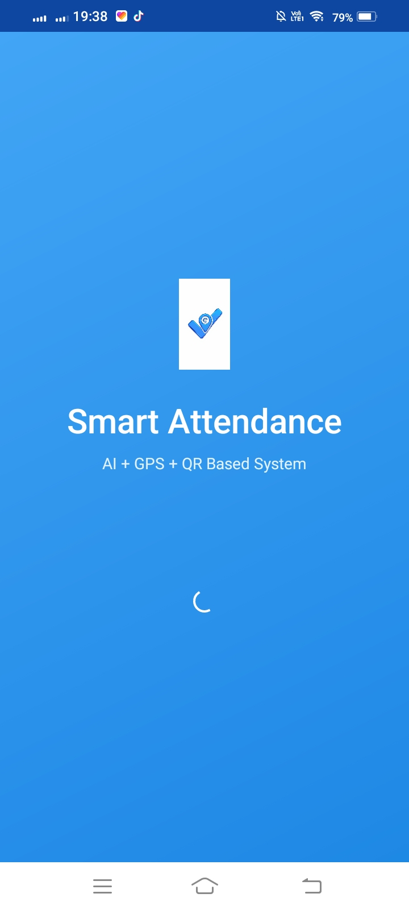
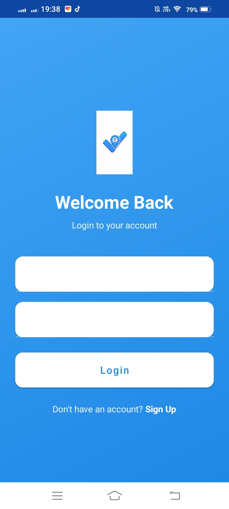
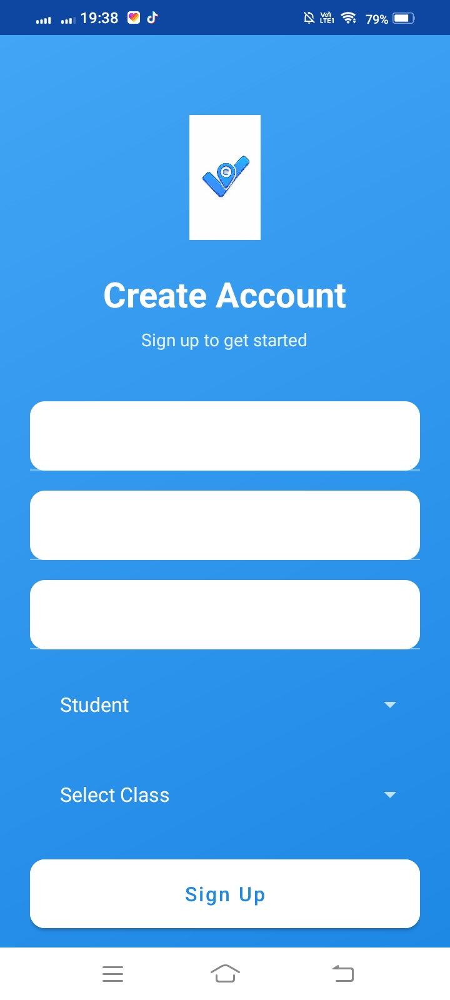
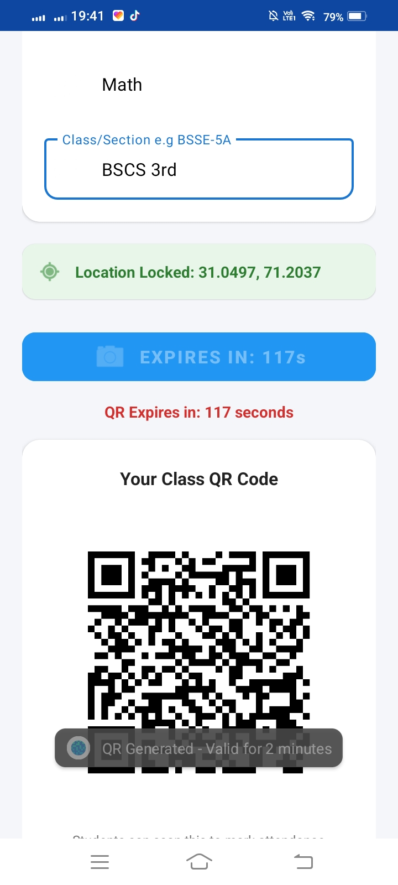
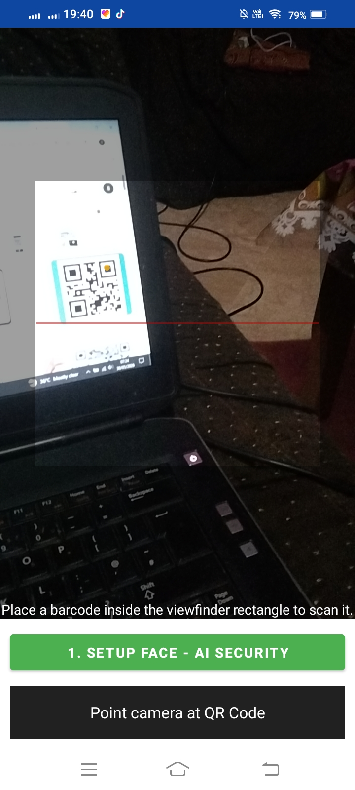
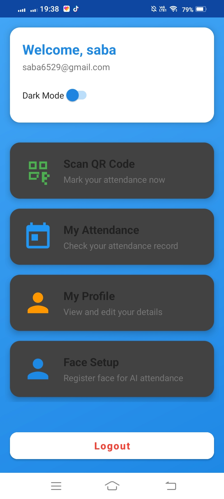
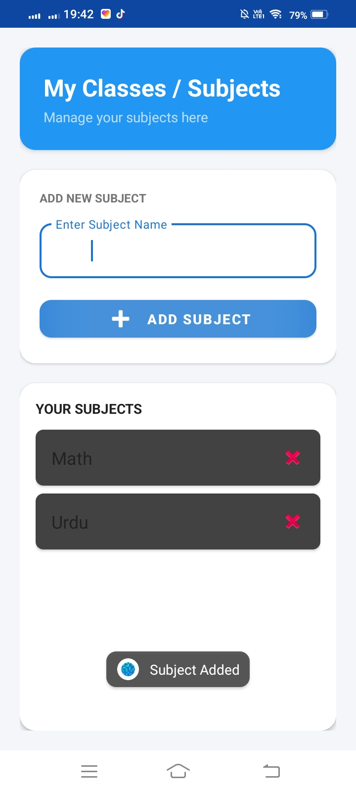
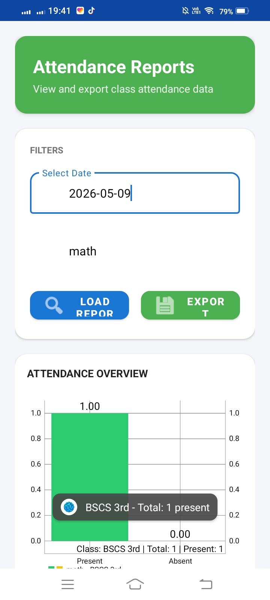

# SmartAttendance
A secure Android application for automated student attendance using QR Code & Face Recognition.

## About the App
SmartAttendance is an Android app developed for University of Layyah students and teachers. It solves the problem of proxy attendance and manual record keeping. Teachers can generate QR codes and verify students via face scan. Students can mark attendance in 2 seconds and view their monthly reports. Main features include QR attendance, face verification, role-based login, and real-time reports.

## App Screenshots

| Splash Screen | Login Screen | Signup Screen |
| :---: | :---: | :---: |
|  |  |  |

| QR Generate | Scanner | Student Dashboard |
| :---: | :---: | :---: |
|  |  |  |

| My Class | View Attendance |
| :---: | :---: |
|  |  |

## Features
- Student, Teacher, Admin role-based login
- QR Code attendance with 2-min expiry
- Face Recognition using Google ML Kit
- Real-time attendance reports
- Student-Teacher in-app chat
- Firebase Realtime Database
- Monthly attendance percentage

## Technologies Used
- Java + XML Layouts
- Android Studio
- Firebase Auth + Realtime Database
- Google ML Kit Face Detection
- ZXing QR Code Library
- Gradle Build System

## APK Download
[Download SmartAttendance.apk](https://github.com/sabasikander379-bit/SmartAttendance-Android/releases/download/v1.0/SmartAttendanceApp.apk)

## How to Install the APK
1. Download APK from above link
2. Transfer to Android phone
3. Settings > Security > Allow "Install unknown apps"
4. Tap APK > Install > Open

## How to Run the Project
1. Open project in Android Studio
2. Sync Gradle files
3. Add google-services.json for Firebase
4. Run on emulator or real device

## Developed By
Areeba Amjad - Roll No: [94]
Saba Sikander - Roll No: [64]
BSCS 6th M Sec B, University of Layyah
Supervisor: Mam Nabiha Komal
